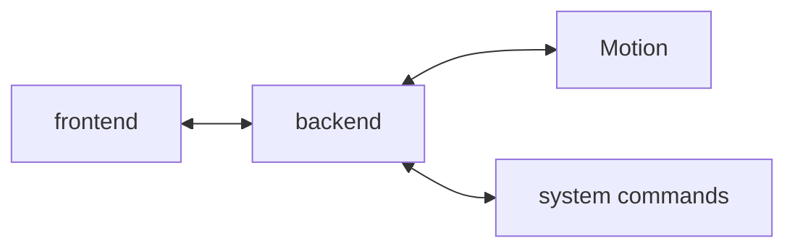

# App4Cam frontend

App4Cam is used on non-lethal camera traps to configure the trap and to access the shots taken.

## System Context

### Context

As an alternative to lethal methods of observing animals, multiple camera traps targeting different species are worked on.
Researchers want to configure these camera traps and access the data captured via an easy-to-use interface in the field.
App4Cam is the software that fills these needs.
Its development started within the scope of the PolliCAM project for the traps Aurinion and DiMon.

### Actors

- Researchers: They install and configure the device in the field. They also download the data.

### Risks

- Using too much energy, especially if the device runs on battery
- Finding the right amount of options needed to give the researchers the autonomy they need while not overwhelming them and not making them break the system

## Mission statement

Enabling researchers to configure their camera traps efficiently and easily in the field as well as accessing the data collected while maintaining a low energy consumption

## Architecture

App4Cam is a web application consisting of both backend and frontend parts.
The backend offers a RESTful API and manages Motion and other system parameters.
The frontend is served via the access point the device provides.

## Technology stack

### Backend

- [NestJS](https://nestjs.com/)
- [TypeScript](https://www.typescriptlang.org/)

### Frontend

- [Quasar](https://quasar.dev/)
- [TypeScript](https://www.typescriptlang.org/)
- [Vue.js](https://vuejs.org/)

## Setup

### Prerequisites

- \>= Node.js 18.x

### Development setup

1. Install dependencies: `npm install`
2. Copy the config file `.env.sample` to `.env`.
3. Edit the latter config file as needed.
4. Start app in development mode: `quasar dev` or `npm run dev`

#### Recommended plugins for Visual Studio Code

- [EditorConfig for VS Code](https://marketplace.visualstudio.com/items?itemName=EditorConfig.EditorConfig)
- [ESLint](https://marketplace.visualstudio.com/items?itemName=dbaeumer.vscode-eslint)
- [Prettier - Code formatter](https://marketplace.visualstudio.com/items?itemName=esbenp.prettier-vscode)
- [Volar](https://marketplace.visualstudio.com/items?itemName=johnsoncodehk.volar)

#### Type support for `.vue` imports in TypeScript with Volar

Since TypeScript cannot handle type information for `.vue` imports, they are shimmed to be a generic Vue component type by default. In most cases this is fine if you don't really care about component prop types outside of templates. However, if you wish to get actual prop types in `.vue` imports (for example to get props validation when using manual `h(...)` calls), you can enable Volar's `.vue` type support plugin by running `Volar: Switch TS Plugin on/off` from VSCode command palette.

#### Development commands

- Run unit tests: `npm run test:unit`
- Rerun unit tests automatically on file changes: `npm run test:unit:watch` or `npm run test:unit:watchAll`
- Lint files: `npm run lint`
- Format files: `npm run format`

### Production setup

#### 1. Prepare the device

1. Install Apache web server: `sudo apt install apache2 -y`
2. Enable rewrite module: `sudo a2enmod rewrite`
3. Enable use of `.htaccess` file by setting `AllowOverride` to `All` in the block for the directory `/var/www/` in the configuration file, usually located under `/etc/apache2/apache2.conf`.
4. Restart Apache: `sudo systemctl restart apache2`
5. If you have not already during backend setup, create a new user, `app4cam` e.g., with a password you remember: `sudo adduser <user>`
6. Transfer Apache folder ownership to your user: `sudo chown -R <user> /var/www/html`

#### 2. Build the application

You can build the application on a computer and copy the build to the device, or you build the application directly on the device:

1. Make sure Git is installed.
2. Clone this repository: `git clone --single-branch --branch main https://git.list.lu/host/mechatronics/app4cam-frontend.git`
3. Change into the directory: `cd app4cam-frontend`
4. Install dependencies: `npm ci`
5. Copy an existing config file to `.env`.

- `.env.pollicam`: for the traps Aurinion and DiMon within the scope of the PolliCAM project
- `.env.sample`: example for the case you run the backend on the same device
- `.env.testing_raspberry_pi`: for continuous deployment (CD) on Raspberry Pi
- `.env.testing_variscite_mx8m`: for continuous deployment (CD) on Variscite MX8M

6. Edit the config file if needed.
7. Build app for production: `quasar build` or `npm run build`
8. Delete old files Apache is serving: `sudo rm -r /var/www/html/*`
9. Copy the build to Apache's serving folder: `sudo cp -r dist/. /var/www/html/`

#### 3. For continuous deployment (CD) only

If you have set up the backend already, you just need to do step 4.

1. Log in as user: `su - <user>`
2. Generate a public/private key pair without passphrase: `ssh-keygen -t ed25519`
3. Copy public key to authorized keys file: `cp .ssh/id_ed25519.pub .ssh/authorized_keys`
4. Define the following variables in Gitlab:

- `RASPBERRY_PI_HOST`: IP address of Raspberry Pi
- `RASPBERRY_PI_PRIVATE_KEY`: private key of Raspberry Pi user
- `RASPBERRY_PI_USER`: user of Raspberry Pi
- `VARISCITE_MX8M_HOST`: IP address of Variscite MX8M
- `VARISCITE_MX8M_PRIVATE_KEY`: private key of Variscite MX8M user
- `VARISCITE_NEWTCAM2_HOST`: IP address of Variscite NEWTCAM version 2
- `VARISCITE_NEWTCAM2_PRIVATE_KEY`: private key of Variscite NEWTCAM version 2 user
- `VARISCITE_USER`: user of Variscite devices

5. Delete private key file: `rm .ssh/id_ed25519`
6. Remove all "group" and "other" permissions for the `.ssh` directory: `chmod -R go= ~/.ssh`
7. Logout: `exit`
8. Open SSH config file: `sudo nano /etc/ssh/sshd_config`
9. Disable password authentication by setting `PasswordAuthentication no`.
10. Prepend the following line: `Match User <user>`
11. Append the following line: `Match all`
12. Restart `sshd` service: `sudo systemctl restart ssh`
13. Install rsync: `sudo apt install rsync -y`

## Release procedure

1. Make sure that you are on the `main` branch and that it is up-to-date.
2. Make sure `CHANGELOG.md` is up-to-date with backend and frontend changes.
3. Use a new version number and create a new section in `CHANGELOG.md`.
4. Update `package.json` with the new version number.
5. Update `package-lock.json`: `npm i --package-lock-only`
6. Commit every change: `git commit -am "release version <version>"`
7. Tag the new version: `git tag v<version>`
8. Push the commit to the remote repository: `git push`
9. Push the tag to the remote repository: `git push --tags`
10. Append `-next` to the version number in `package.json`.
11. Update `package-lock.json`: `npm i --package-lock-only`
12. Commit every change: `git commit -am "prepare next release"`
13. Push the commit to the remote repository: `git push`
