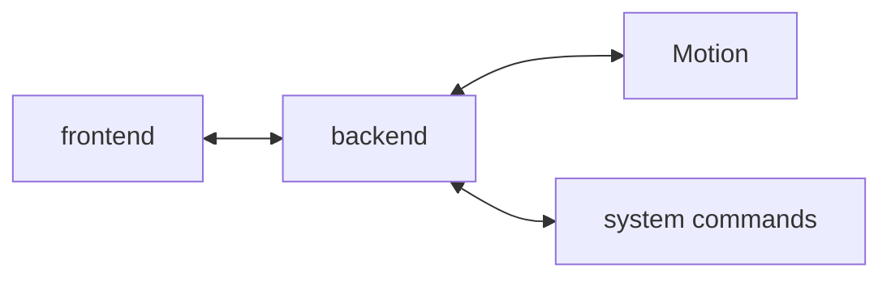

# App4Cam frontend

App4Cam is used on non-lethal camera traps to configure the trap and to access the shots taken.

## System Context

### Context

As an alternative to lethal methods of observing animals, multiple camera traps targeting different species are worked on.
Researchers want to configure these camera traps and access the data captured via an easy-to-use interface in the field.
App4Cam is the software that fills these needs.
Its development started within the scope of the PolliCAM project for the traps Aurinion and DiMon.

### Actors

- Researchers: They install and configure the device in the field. They also download the data.

### Risks

- Using too much energy, especially if the device runs on battery
- Finding the right amount of options needed to give the researchers the autonomy they need while not overwhelming them and not making them break the system

## Mission statement

Enabling researchers to configure their camera traps efficiently and easily in the field as well as accessing the data collected while maintaining a low energy consumption

## Architecture



App4Cam is a web application consisting of both backend and frontend parts.
The backend offers a RESTful API and manages Motion and other system parameters.
The frontend is served via the access point the device provides.

## Technology stack

### Backend

- [NestJS](https://nestjs.com/)
- [TypeScript](https://www.typescriptlang.org/)

### Frontend

- [Quasar](https://quasar.dev/)
- [TypeScript](https://www.typescriptlang.org/)
- [Vue.js](https://vuejs.org/)

## Development

### Development setup

1. Make sure to have Node.js installed in version >= 18.x.
2. Install dependencies:

```shell
pnpm install
```

3. Copy the config file `.env.sample` to `.env`.
4. Edit the latter config file as needed.
5. Start app in development mode:

```shell
quasar dev
```

or

```shell
pnpm run dev
```

#### Recommended plugins for Visual Studio Code

- [EditorConfig for VS Code](https://marketplace.visualstudio.com/items?itemName=EditorConfig.EditorConfig)
- [ESLint](https://marketplace.visualstudio.com/items?itemName=dbaeumer.vscode-eslint)
- [Prettier - Code formatter](https://marketplace.visualstudio.com/items?itemName=esbenp.prettier-vscode)
- [Volar](https://marketplace.visualstudio.com/items?itemName=johnsoncodehk.volar)

#### Type support for `.vue` imports in TypeScript with Volar

Since TypeScript cannot handle type information for `.vue` imports, they are shimmed to be a generic Vue component type by default. In most cases this is fine if you don't really care about component prop types outside of templates. However, if you wish to get actual prop types in `.vue` imports (for example to get props validation when using manual `h(...)` calls), you can enable Volar's `.vue` type support plugin by running `Volar: Switch TS Plugin on/off` from VSCode command palette.

#### Development commands

- Run unit tests:

```shell
pnpm run test:unit:ci
```

- Rerun unit tests automatically on file changes:

```shell
pnpm run test:unit:watch
```

- Run app in development and test concurrently:

```shell
pnpm run concurrently:dev:vitest
```

- Lint files:

```shell
pnpm run lint
```

- Format files:

```shell
pnpm run format
```

#### Copyright notice usage

The following copyright notice must be included as a comment at the beginning of every source code file:

```
© <year> Luxembourg Institute of Science and Technology
```

As year, indicate the year of creation. When making changes to code with an existing notice, retain the earliest copyright year, and optionally add the current copyright year, e.g.:

```
© 2022-2024 Luxembourg Institute of Science and Technology
```

## Production setup

#### 1. Prepare the device

Copy and execute the following setup script:

```
scripts/setup/set-up-web-server-and-user.sh
```

#### 2. Build the application

You can build the application on a computer and copy the build to the device, or you build the application directly on the device:

1. Make sure Git is installed.
2. Clone this repository: `git clone --single-branch --branch main https://git.list.lu/host/mechatronics/app4cam-frontend.git`
3. Change into the directory: `cd app4cam-frontend`
4. Install dependencies: `npm ci`
5. Copy an existing config file to `.env`.

- `.env.pollicam`: for the traps Aurinion and DiMon within the scope of the PolliCAM project
- `.env.sample`: example for the case you run the backend on the same device
- `.env.testing_raspberry_pi`: for continuous deployment (CD) on Raspberry Pi
- `.env.testing_variscite_mx8m`: for continuous deployment (CD) on Variscite MX8M

6. Edit the config file if needed.
7. Build app for production: `quasar build` or `npm run build`
8. Delete old files Apache is serving: `sudo rm -r /var/www/html/*`
9. Copy the build to Apache's serving folder: `sudo cp -r dist/. /var/www/html/`

#### 3. For continuous deployment (CD) only

Define the following variables in Gitlab:

- `APP4CAM_USER`: user of application
- `RASPBERRY_PI_HOST`: IP address of Raspberry Pi
- `RASPBERRY_PI_PRIVATE_KEY`: private key of App4Cam user on Raspberry Pi
- `VARISCITE_MX6_HOST`: IP address of Variscite MX6
- `VARISCITE_MX6_PRIVATE_KEY`: private key of App4Cam user on Variscite MX6
- `VARISCITE_MX8M_HOST`: IP address of Variscite MX8M
- `VARISCITE_MX8M_PRIVATE_KEY`: private key of App4Cam user on Variscite MX8M
- `VARISCITE_NEWTCAM3_HOST`: IP address of Variscite NEWTCAM 3
- `VARISCITE_NEWTCAM3_PRIVATE_KEY`: private key of App4Cam user on Variscite NEWTCAM 3

If you have not set up the backend already, copy and execute the following setup script:

```
scripts/setup/set-up-continuous-deployment.sh
```

## Release procedure

1. Make sure `CHANGELOG.md` is up-to-date with backend and frontend changes.
2. Use a new version number and create a new section in `CHANGELOG.md`.
3. Run the following script with a real version number in a Git Bash:

```shell
scripts/release-version.sh "<version-number>"
```

4. Push the pre-version commit to the remote repository once it should be shared:

```shell
git push
```
